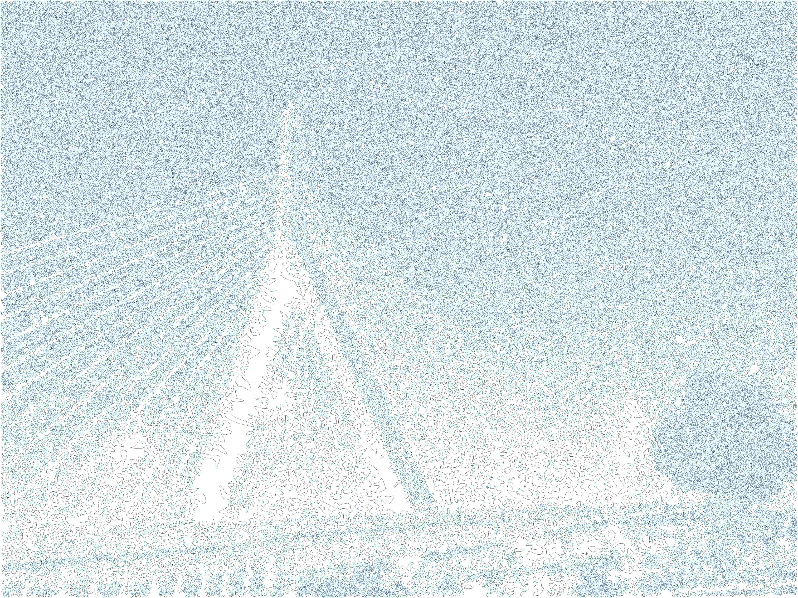

# About

I like writing my own photo filters. I keep them all in this repo.

### Pixel clustering

The first idea I ever added here is a script that finds "clusters" of similarly
colored pixels in an image and replaces each cluster with a solid color. I used
that project to learn GPU programming.

My first attempt at this is in `group_pixels_cpu.py`. It doesn't use the GPU,
and takes about 200 seconds to process `photos/building.jpg`, depending on the
settings. It's based on the idea of running a graph search starting from a
"seed" point to compute each cluster. (It takes linear time, but there are a
lot of pixels.)

My second attempt is in `group_pixels_opencl.py`. I spent a few hours musing on
how to parallelize the original graph search algorithm, and then lit on the odd
idea of running simultaneous graph searches from literally every pixel at once.
The computation is a bit like running Conway's Game of Life on a GPU, in that
there's a series of rounds, and in each round, the new value of a pixel is
determined from the values of its neighboring pixels (and itself). With enough
rounds it converges to have similar output to the CPU algorithm:


But if you cut off the GPU algorithm early, you can see squares where the pixel
groups are still spreading:


Is the GPU version faster than the CPU version? Not on my laptop. But on my
friend's fancy gaming desktop it can do the full bridge photo in 3 seconds.

### Long squiggly line filter

There's also "noodlize.py", which recreates a given image in detail using just
one long squiggly line. See the docstring on that file for instructions to run
the script.



# How to run

## Setup

Install some Python things:

```shell
pip3 install absl-py numpy pillow pyopencl
```

(You really ought to use a virtual environment or something, eg
virtualenvwrapper. Pillow is a textbook example of why to use a virtual env,
since it is mutually exclusive with the older PIL package.)

You'll also need to install an OpenCL driver / runtime. This is hardware and OS
specific. For example, on my laptop, I'm running Arch Linux, and I have an intel
processor with an integrated GPU. So I ran `pacman -S intel-compute-runtime`.

When you run my `group_pixels_opencl.py` script, OpenCL will complain and prompt
you to select an OpenCL context. (Even if you have just exactly one installed.)
I found that setting an empty value of `PYOPENCL_CTX` was sufficient to make
this prompt go away.

```shell
export PYOPENCL_CTX=
```

## Running the "group pixels" scripts

Take a look at the flags documentation, or run the scripts with the `--help` flag.
Here are some examples that give nice results. Feel free to muck with the
settings or use a different photo. (There are three nice ones in `photos/`.)

The scripts (CPU and GPU) have inconsistent flags, and I don't plan to fix it.
They're good enough.


### CPU code

```shell
# Takes several minutes (200-ish seconds).
# This is how I got examples/building_outline.png and examples/building.png
python3 group_pixels_cpu.py \
  --infile=photos/building.jpg \
  --threshold=20 \
  --threshold_increment=0.5 \
  --color_outfile=/tmp/foo.png \
  --outline_outfile=/tmp/bar.png


# Way faster but can still take 30-ish seconds because the deadline is soft.
python3 group_pixels_cpu.py \
  --infile=photos/building.jpg \
  --threshold=20 \
  --threshold_increment=0.5 \
  --time_limit_seconds=10
```

### GPU code

(See the Setup section if you get errors from OpenCL.)

```shell
# This is my favorite version of the bridge. Takes 16 seconds on my laptop.
python3 group_pixels_opencl.py \
  --infile=photos/bridge.jpg \
  --iterations=150 \
  --threshold=30 \
  --outfile=examples/bridge_150_iterations.png

# Takes 260 seconds on my laptop. The result pleases me because it's very
# similar to the CPU version of the bridge image -- which is good because I
# intended the GPU version to be equivalent at this high number of iterations.
python3 group_pixels_opencl.py \
  --infile=photos/bridge.jpg \
  --threshold=30 \
  --outfile=examples/bridge_all_iterations.png
```
